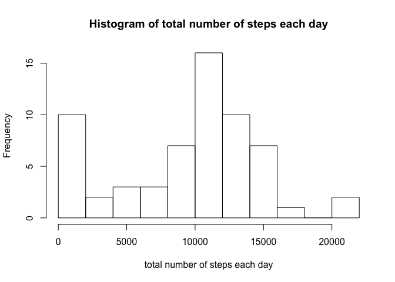
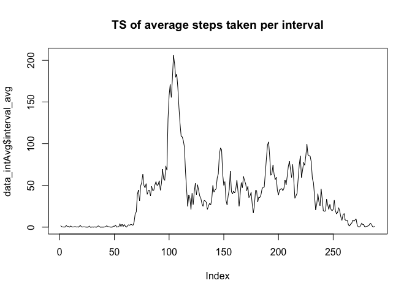
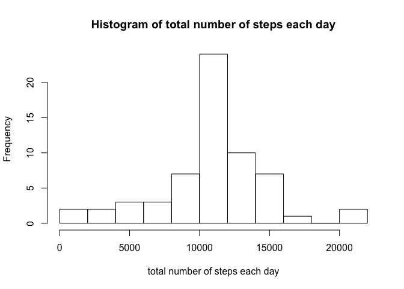
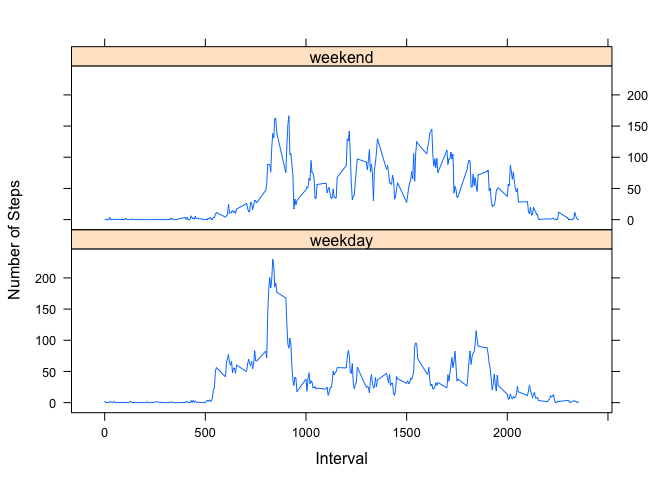

# Reproducible Research: Peer Assessment 1

## Loading and preprocessing the data
Unzip, load and pre-process the data.


```r
data <- read.csv(unz("activity.zip" , "activity.csv"))
data$date <- ymd(data$date)
```

## What is mean total number of steps taken per day?


```r
## creae a vector for total steps for each day
data_steps <- data %>% group_by(date) %>% summarize(total_step = sum(steps, na.rm = TRUE))

## draw histogram
hist(data_steps$total_step, breaks = 10, 
     main = "Histogram of total number of steps each day", 
     xlab = "total number of steps each day")
```

<!-- -->

```r
## compute mean and meadian of total steps taken per day
total_step_mean <- mean(data_steps$total_step, na.rm = TRUE)
total_step_median <- median(data_steps$total_step, na.rm = TRUE)
```
The mean number of steps taken each day: 9354.23.
The median number of steps taken each day: 10395.

## What is the average daily activity pattern?

```r
## creae a vector for time series of average number of steps
data_intAvg <- data %>% group_by(interval) %>% summarize(interval_avg = mean(steps, na.rm = TRUE))

## plot the time series
plot(data_intAvg$interval_avg, type = "l",  main = "TS of average steps taken per interval")
```

<!-- -->

```r
## compute the interval that contains the max 
interval_max <- with(data_intAvg, interval[which.max(interval_avg)])
```
The interval that contains the maximum number of steps on average: 835.

## Imputing missing values
Total number of missing number 2304.

Fill missing number with average of the intervals across days


```r
## find the index of missing 
na_index <- which(is.na(data)) 

## match interval index of missing values
pattern_index <- match(data[na_index, "interval"], data_intAvg$interval) 
                                                                    
## create data with filled missing values
data_fill <- data
data_fill[na_index, "steps"] <- data_intAvg[pattern_index, "interval_avg"]
```

Re-do the histogram with missing number filled.

```r
datafill_steps <- data_fill %>% group_by(date) %>% summarize(total_step = sum(steps, na.rm = TRUE))
hist(datafill_steps$total_step, breaks = 10, 
     main = "Histogram of total number of steps each day", 
     xlab = "total number of steps each day")
```

<!-- -->

## Are there differences in activity patterns between weekdays and weekends?

```r
## create weekday/weekend factor
data_fill <- data_fill %>% transform(day = factor(ifelse(
    weekdays(date) %in% c("Saturday", "Sunday"), "weekend", "weekday")))

## create average steps with weekday/weekend grouping
data_fill_avg <- data_fill %>% group_by(interval, day) %>% summarize(interval_avg = mean(steps, na.rm = TRUE))

## plot comparing weekday/weekend
xyplot(interval_avg ~ interval | day, data = data_fill_avg, type = "l", 
       layout = c(1,2), xlab = "Interval", ylab = "Number of Steps")
```

<!-- -->
